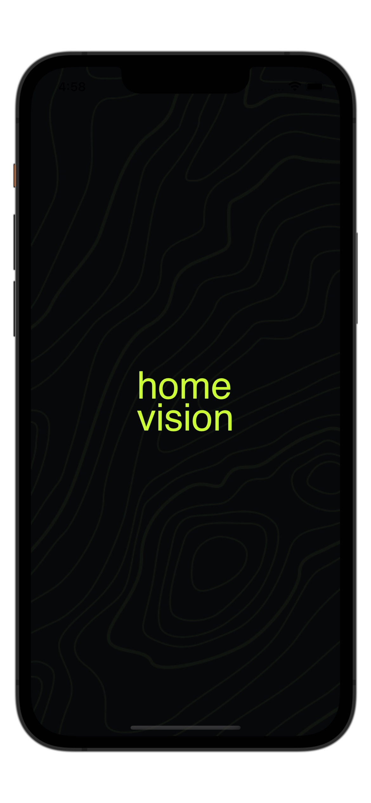

  

## Table of Contents
- <a href="#about">About</a>
- <a href="#previews">Previews</a>
- <a href="#project-tech-stack">Project Tech Stack</a>

## About
**HomeVision** is a smart home monitoring app developed for iOS devices. The app allows users to track and control various sensor data in their homes. Using Firebase as the backend, this application provides users with the ability to manage their homes comfortably and effectively.

**Gas Sensor:** With the gas sensor, you can detect natural gas leaks in your home and receive instant notifications through the app. This allows you to act quickly to prevent potential hazards.

**Light:** The app enables you to turn your home's lights on and off. This way, you can save energy and make your home more comfortable.

**Air Conditioner:** Through the app, you can operate your air conditioner at your desired temperature and mode. By controlling your air conditioner settings via the app, you can save energy and make your home more comfortable.

**Temperature & Humidity:** The app allows you to monitor the temperature and humidity levels in your home. This helps you optimize your home's climate conditions and create a healthy living space.

**Camera:** You can control your home's security cameras through the app and watch live footage. This ensures that your home's security is always under your watchful eye.

**Daily Weather:** The app displays the daily weather conditions in your city. This allows you to check the weather conditions before going outside and plan accordingly.

## Previews
| Splash Screen | Home Screen |
| --- | --- |
|  |  |

## Project Tech Stack
- Xcode: Version 14.2
- Minimum iOS Version: 15.0
- Design Pattern: MVVM
- Dependenct Manager: Swift Package Manager
- Dependencies: **Alamofire, Firebase**

## Trailer

